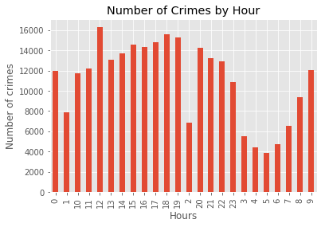
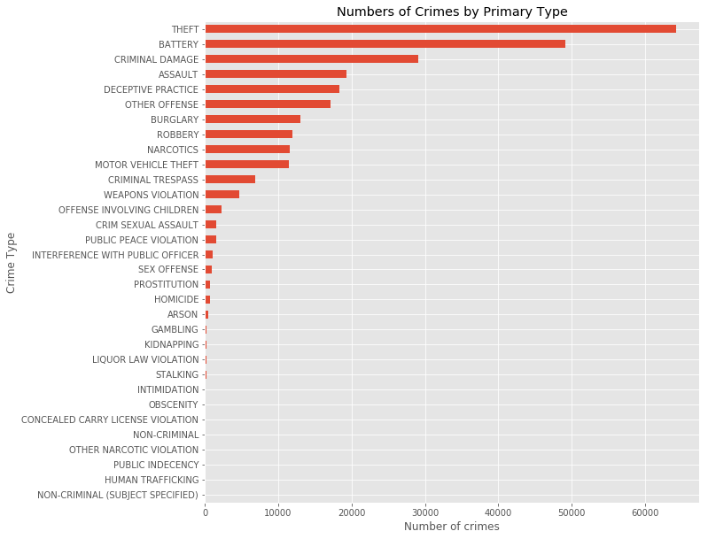
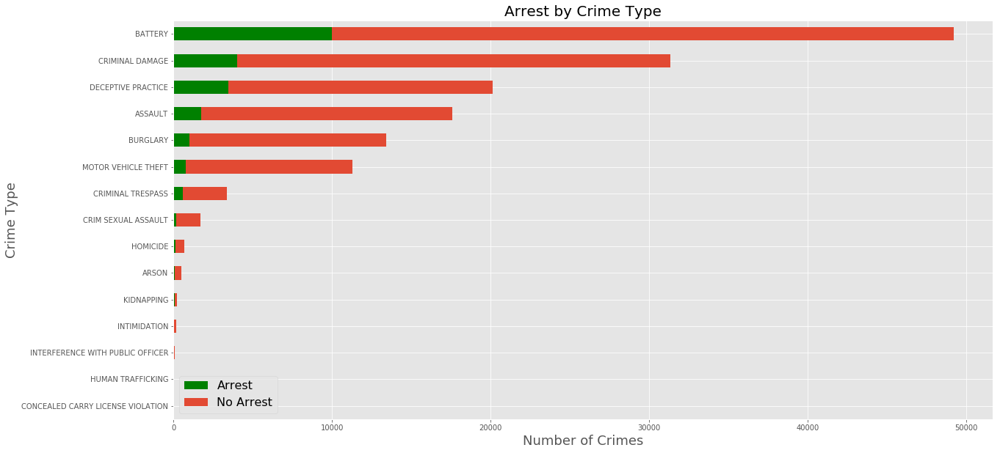

# Explore and Predict Crimes in Chicago

An individual urban data science and machine learning coursework project completed in 2018 for the MRes Spatial Data Science and Visualisation program at University College London (UCL).

The project uses a real public dataset containing **266,862 reported Chicago crime incidents from 2017**. It demonstrates an end-to-end analytical workflow involving data inspection, cleaning, feature engineering, exploratory visualization, classification, cross-validation, and model evaluation.

## Project objectives

- Explore temporal, geographic, crime-type, location, and arrest patterns.
- Engineer temporal and categorical features for analysis and modeling.
- Predict whether a reported incident resulted in an arrest.
- Predict the category of crime associated with an incident.
- Compare Decision Tree and Random Forest classifiers.

## Data source

- **Data owner:** Chicago Police Department
- **Dataset:** [Chicago Data Portal — Crimes, 2001 to Present](https://data.cityofchicago.org/Public-Safety/Crimes-2001-to-present/ijzp-q8t2)
- **Extract used:** 266,862 incidents reported during 2017

The dataset includes incident dates, crime categories, location descriptions, arrest and domestic indicators, administrative geographies, and geographic coordinates.

## Analysis workflow

1. Inspected the dataset, data types, categories, and missing values.
2. Cleaned and restructured selected variables.
3. Derived month, day, weekday, hour, and day/night features.
4. Organized community areas into broad Chicago side categories.
5. Visualized temporal, geographic, crime-type, location, and arrest patterns.
6. Encoded categorical variables for machine learning.
7. Split the data into training and test sets.
8. Tuned Decision Tree and Random Forest classifiers with cross-validation.
9. Evaluated the models using classification reports and confusion matrices.

## Selected findings

- Noon was the highest-frequency hour in the 2017 extract.
- The stored classification reports showed stronger overall weighted metrics for the Decision Tree than for the Random Forest.
- Positive-class arrest recall was substantially lower than the overall weighted metrics: **0.50** for the Decision Tree and **0.39** for the Random Forest.
- Crime-category prediction was not convincing, indicating that the selected temporal and geographic features did not adequately distinguish among crime categories.

The project reports both the models' comparative strengths and the areas where their predictions were less effective.

## Technical context

The notebook uses the Python and machine learning environment available when the project was completed in 2018. Some APIs have since been renamed or deprecated, and the original CSV is not included in the repository. The stored results are presented as historical project outputs rather than as a currently maintained modeling pipeline.

## Data access

The original CSV is not included. The data should be retrieved directly from the official Chicago Data Portal. Reproducing the exact original extract would require recreating the 2017 filter and expected schema.

## Tools and libraries

- Python 3.6.2
- Jupyter Notebook
- NumPy 1.13.1
- pandas 0.20.3
- Matplotlib 2.0.2
- scikit-learn 0.19.0

The workflow uses categorical encoding, train/test splitting, grid-search cross-validation, Decision Tree and Random Forest classifiers, classification reports, and confusion matrices.

## Repository contents

- [`Explore and Predict Crimes in Chicago.ipynb`](./Explore%20and%20Predict%20Crimes%20in%20Chicago.ipynb) — analysis, visualizations, models, and stored results
- `README.md` — project overview and documentation
- `.gitignore` — Python and Jupyter exclusions

## Historical context

This notebook is preserved in its original 2018 analytical and software context. The package versions and APIs reflect the tools available when the project was completed.
